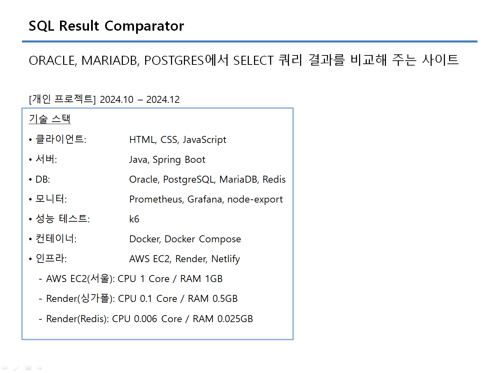
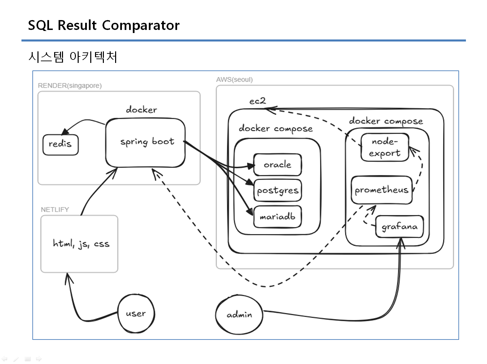
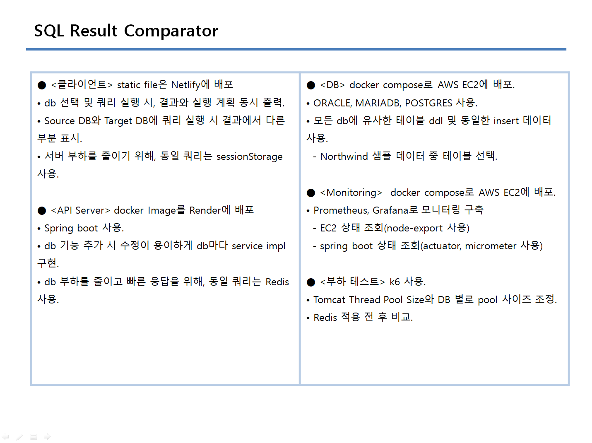
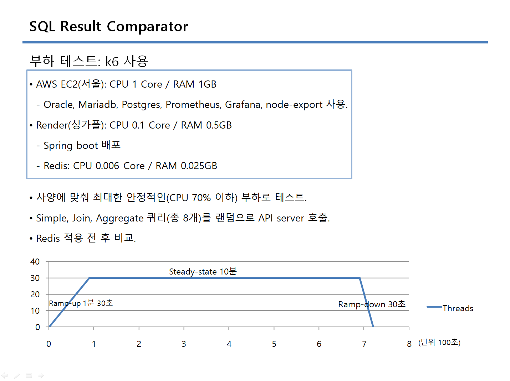
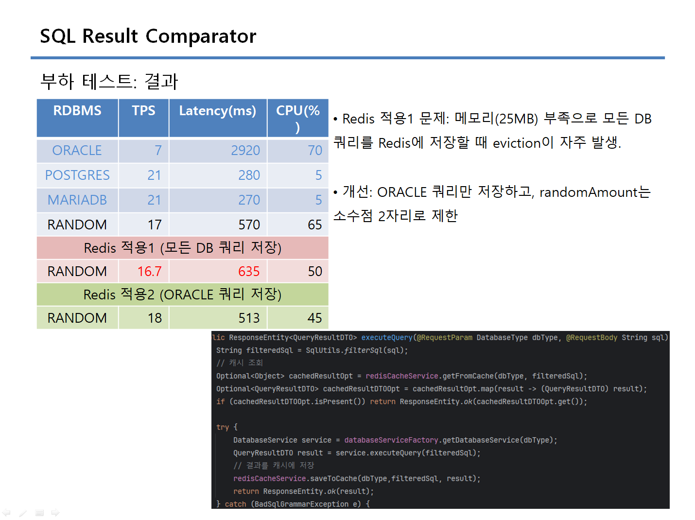

# SQL Result Comparator
SourceDB와 TargetDB를 선택하여 쿼리 결과를 비교할 수 있는 사이트.
- 쿼리 결과와 실행 계획을 동시에 출력하며, 학습 목적으로 제작.
1.	동일 DB에서 동일한 결과를 도출하는 쿼리 간 실행 계획 비교.
2.	서로 다른 DB에서 동일한 결과를 도출하기 위한 마이그레이션 및 문법 비교 용도.

[https://comparedb.netlify.app](https://comparedb.netlify.app)

## 프로젝트 설명

